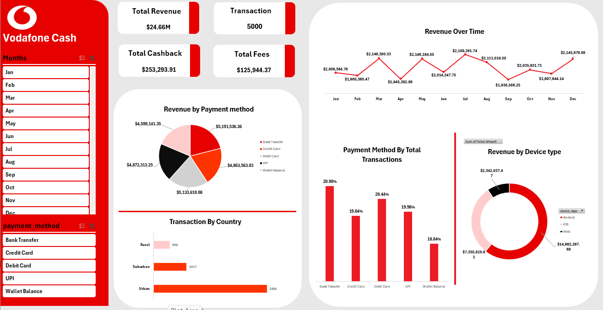

# vodafone-cash-dashboard
Excel dashboard analyzing 5,000 digital wallet transactions.
Vodafone Cash — Digital Wallet Transactions Dashboard
My first data analytics dashboard, built in Excel as part of my data analytics diploma coursework (Route Academy). It analyzes 5,000 digital wallet transactions to uncover patterns in revenue, payment methods, and user behavior.

## Dowenload
[Download Dashboard (Excel)](./Vodafon Cash Dashboard.xlsx)
📌 Project Overview
Digital wallets like Vodafone Cash generate large volumes of transaction data every day. This project simulates the kind of analysis a business analyst would run to understand where revenue comes from, how customers pay, and who is using the platform — turning a raw transaction log into decision-ready insights.
🎯 Objectives
Clean and structure a raw transaction dataset for analysis
Build calculated fields (revenue, fees, cashback) using formulas
Summarize the data with PivotTables
Design a one-page Excel dashboard for a non-technical audience
🗂️ Dataset
`digital_wallet_transactions` — 5,000 rows, 17 columns, including:
Column	Description
`transaction_date`	Date/time of the transaction
`product_category`	e.g. Rent Payment, Mobile Recharge, Grocery Shopping
`product_amount`, `transaction_fee`, `cashback`, `Paied Amount`	Transaction-level monetary fields
`payment_method`	Bank Transfer, Credit Card, Debit Card, UPI, Wallet Balance
`transaction_status`	Successful / Failed
`device_type`	Android, iOS, Web
`location`	Urban, Suburban, Rural
🔑 Key Insights
Total revenue: $24.66M across 5,000 transactions, with $125.9K in fees and $253.3K paid out in cashback
Payment methods are evenly used — Bank Transfer (21%), Debit Card (20%), UPI (20%), Credit Card (20%), and Wallet Balance (19%) each drive a similar share of revenue
Android dominates the platform, generating ~$15.0M (61%) of revenue vs. $7.4M on iOS and $2.3M on Web
Urban users drive the bulk of activity — 3,485 of 5,000 transactions (70%), vs. 1,017 Suburban and 498 Rural
Revenue is stable month over month, ranging narrowly between ~$1.94M and ~$2.19M with no strong seasonal spike
🛠️ Tools Used
Microsoft Excel — data cleaning, calculated columns, PivotTables, PivotCharts, dashboard layout
🚀 How to View
Download `Vodafon_Cash_Dashboard.xlsx`
Open the "Vodafone Dashboard" tab for the visual summary
See "Pivot tables" for the underlying PivotTables, and "digital_wallet_transactions" for the raw/cleaned data
This is my first dashboard project — feedback is very welcome! Connect with me on LinkedIn (www.linkedin.com/in/mohamed-samy-407a92239).
